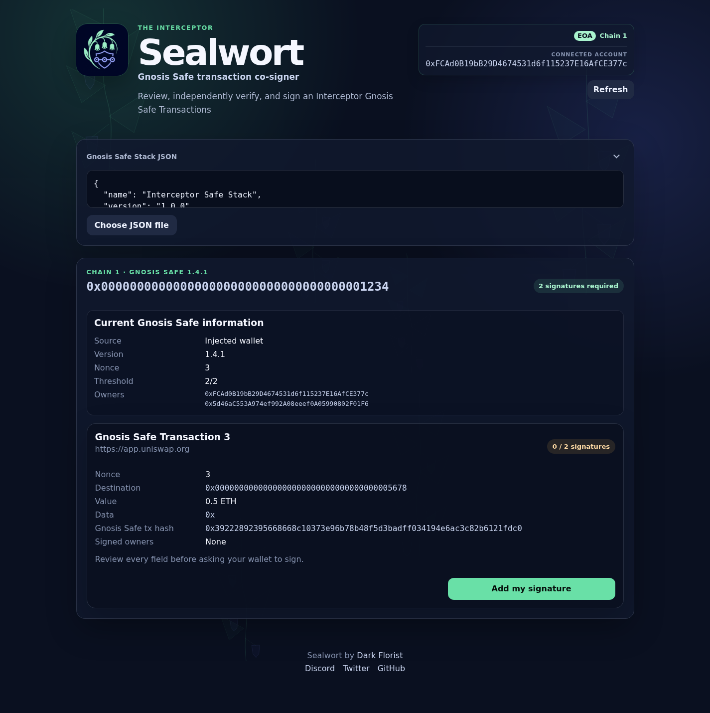
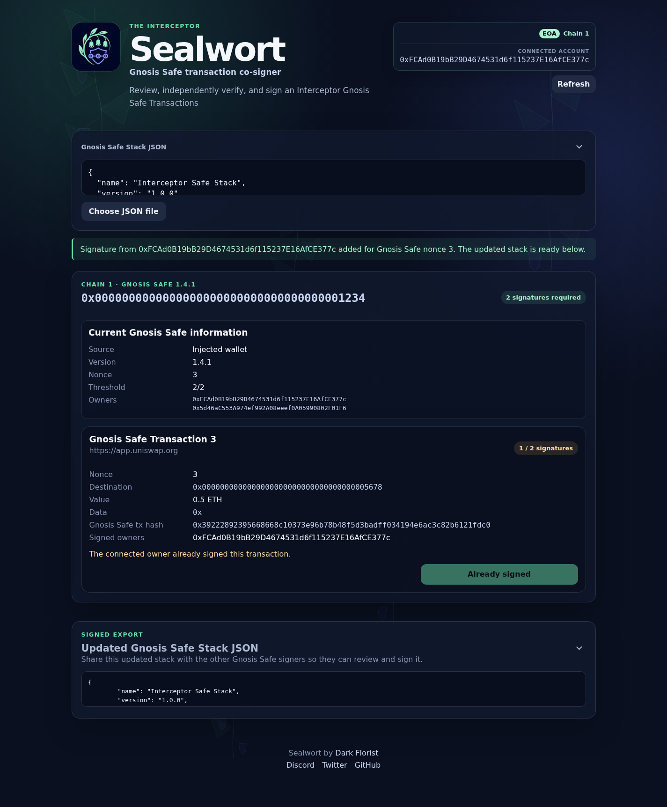

# Sealwort

Sealwort is a static Gnosis Safe transaction co-signer for [The Interceptor](https://github.com/DarkFlorist/TheInterceptor).
It lets Safe owners review an exported Interceptor Gnosis Safe Stack, independently
verify every transaction against current on-chain state, add EIP-712 owner signatures,
share the updated JSON with other signers, and execute transactions once they reach
their signature threshold.



## What Sealwort does

1. Paste an `Interceptor Gnosis Safe Stack` JSON export.
2. Recompute transaction hashes and validate existing signatures.
3. Display the current Safe version, nonce, owners, threshold, balances, connected
   wallet, and active signer when the wallet exposes one.
4. Ask the connected owner wallet to sign the canonical Safe EIP-712 transaction.
5. Display the updated stack below the transactions so it can be shared with the
   other Gnosis Safe signers.
6. When enough signatures are present, submit the execution through an EOA account or
   a compatible connected Safe wallet.



Sealwort reads current Safe information through the injected wallet when it is on
the stack's chain. For Ethereum mainnet stacks, it falls back to the HTTP or HTTPS
endpoint selected in RPC settings when no matching injected provider is available. The
default is `https://ethereum.dark.florist`, and a custom choice is preserved in
local browser storage. Using the fallback discloses the imported Safe address to
that RPC. Signing always requires an injected owner wallet and never uses the
fallback RPC.

Sealwort preserves the pasted stack in local browser storage, so refreshing the
page does not discard an in-progress signing session. The Refresh action reloads
wallet identity and stack state; balances and active-signer information load
independently without hiding the rest of the account summary.
If browser storage is unavailable, Sealwort keeps signing available but warns that
refreshing or reopening the page may lose the current stack or restore an older one.

Before a stack is imported, Sealwort passively inspects the account already
selected in the injected wallet. It distinguishes EOAs, supported Safes, and other
contracts and displays live Safe details when the account itself is a Safe. After
import, the connected-account panel stays as a compact identity summary while
the stack displays the detailed Safe state once. Sealwort automatically rechecks
the imported stack when the wallet account or chain changes, and reports whether
that connected Safe matches the stack or whether the connected EOA is a current
owner. Standard Ethereum RPC cannot reverse-map an EOA to one unique Safe without
an external indexer.

For a connected Gnosis Safe, Sealwort displays its native balance. Ethereum
mainnet additionally shows USDC, while Ethereum Sepolia shows the balances as
SepoliaETH and SepoliaUSDC. Unrecognized EVM chains show only their native
balance, labeled ETH. Balance-read failures remain informational and do not
prevent stack verification or signing.

The proposer imports the returned JSON into Interceptor, which accepts only
signatures for locally created, unchanged Safe proposals.

When the connected account is a compatible Safe wallet facade, Sealwort reads its
advertised `wallet_getCapabilities` response to discover the active EOA signer and
whether the wallet can route completed executions. Sealwort verifies the recovered
owner before adding a signature. The capability key is application-specific while
the capability discovery method is the standard wallet RPC method.

Before enabling execution, Sealwort checks the Safe vault balance for native-value
transfers and checks that the active gas payer can cover an estimated execution.
These checks are repeated immediately before the wallet request.

## Security boundaries

- Supports Safe Stack wire-format version `1.0.0`. The top-level `version`
  discriminator is checked before parsing, so future formats are rejected with an
  explicit unsupported-version error until support is implemented.
- Supports released Safe proxy and singleton deployments for versions 1.3.0 and
  1.4.1. Both proxy and singleton runtime bytecode are checked against the
  official release artifacts at the same block used for state validation;
  interface-compatible contracts and unrecognized implementations are rejected.
- Supports EOA owners, `CALL` operations, and zero Safe reimbursement.
- Revalidates the wallet account, chain, Safe state, transaction hashes, signatures,
  transfer balance, and execution gas funding before signing or execution.
- Rejects stale nonces, changed thresholds or versions, contract owners,
  delegatecalls, duplicate signatures, and altered transaction lists.
- Includes framing protection through both response headers and a fail-closed
  top-level runtime check.
- Accepts HTTP and HTTPS custom RPC endpoints without embedded credentials or URL
  fragments. The CSP uses `connect-src *` so a static deployment can reach the
  endpoint selected by the user at runtime. A response or meta CSP
  cannot be expanded after delivery, so a static build cannot add only a
  browser-stored custom host to the original single-origin allowlist.
- Explicitly accepts that configurable RPC hosts broaden `connect-src` from one
  origin to arbitrary network origins. Compensating controls
  include the strict runtime Safe Stack schema, Preact text escaping for imported
  and provider-controlled values, no raw-HTML or dynamic-code rendering paths, and
  the remaining restrictive CSP directives (`default-src 'none'`, same-origin
  scripts, and disabled objects).

## Development

Install dependencies and run all checks:

```bash
bun install --frozen-lockfile
bun run check
```

Build the static site:

```bash
bun run build
```

The deployable files are written to `src/dist`. Serve them from a host that applies
the rules in `_headers`, especially `Content-Security-Policy: frame-ancestors
'none'` and `X-Frame-Options: DENY`.

Application TypeScript and TSX live in `src/app`, static images in `src/assets`,
styles in `src/styles`, and the HTML and deployment headers remain in `src`.
The production build mirrors that separation under `src/dist/js`,
`src/dist/assets`, and `src/dist/styles`.

To build Sealwort in Docker and publish the resulting directory to a Kubo node
running on the Docker host:

```bash
bun run ui:docker
```

This follows the Zoltar Docker publishing pattern. It expects the host's Kubo RPC
API to be reachable from the container on port `5001`, uploads `/export`, verifies
that the published CID exactly matches the build-time CID, and prints the local
subdomain-gateway URL. By default it connects to
`/dns4/host.docker.internal/tcp/5001`, which works with Docker Desktop on Windows
and macOS as well as the script's Docker host-gateway mapping on Linux. It does
not start or reconfigure Kubo.

On Linux, a native Kubo daemon's default loopback-only
`/ip4/127.0.0.1/tcp/5001` RPC listener is not reachable through Docker's host
gateway. Use a Kubo container/network arrangement that keeps RPC access trusted,
or bind Kubo to a private address reachable from the build container and restrict
that port with the host firewall.

To use another reachable Kubo RPC address, provide its multiaddress:

```bash
IPFS_API_MULTIADDR=/ip4/192.0.2.10/tcp/5001 bun run ui:docker
```

Do not expose the Kubo RPC API to an untrusted network.

The tag workflow in `.github/workflows/ipfs-deploy.yml` builds a deterministic
IPFS CID and attaches a CAR file to the GitHub release. It intentionally does
not select or authenticate to an IPFS pinning provider; an operator can import
that CAR into the chosen host and verify it against the accompanying
`ipfs-cid.txt`.

## Source relationship

Sealwort contains a small local implementation of Safe Stack format `1.0.0` and
the Safe-specific EIP-712, signature-recovery, and read-only ABI operations it
needs. It deliberately excludes Interceptor UI, simulation, ENS, address-book,
generic transaction, and RPC types. Compatibility tests lock down the format
discriminator, hashes, signatures, and serialization without requiring the
extension at build time. Raw fixtures generated by the corresponding Interceptor
implementation also lock down the cross-repository stack and connected Safe wallet
capability contracts.
